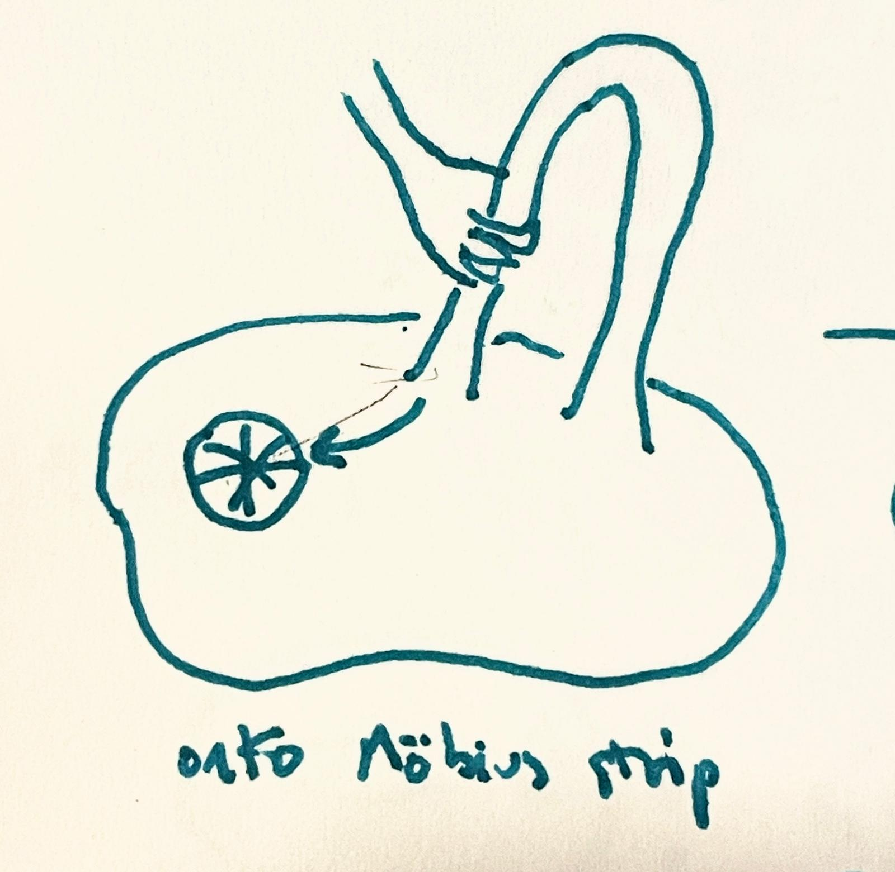

```
from model import Clip
m = Clip()
m.embed_texts(["a handle and an asterisk are just three asterisks"])

from PIL import Image
im = Image.open("handle-and-asterisk.jpg")
m.embed_images([im])
```

use `onnxruntime`, `numpy`, and `pillow` to run CLIP models

download weights:
[ViT-B/32 image model](https://lakera-clip.s3.eu-west-1.amazonaws.com/clip_image_model_vitb32.onnx)
& [ViT-B/32 text model](https://lakera-clip.s3.eu-west-1.amazonaws.com/clip_text_model_vitb32.onnx)

alternatively, export your own models to ONNX using `torch.onnx.export` and
OpenAI's `clip` library with `export.py`

a pruned version of https://github.com/lakeraai/onnx_clip
